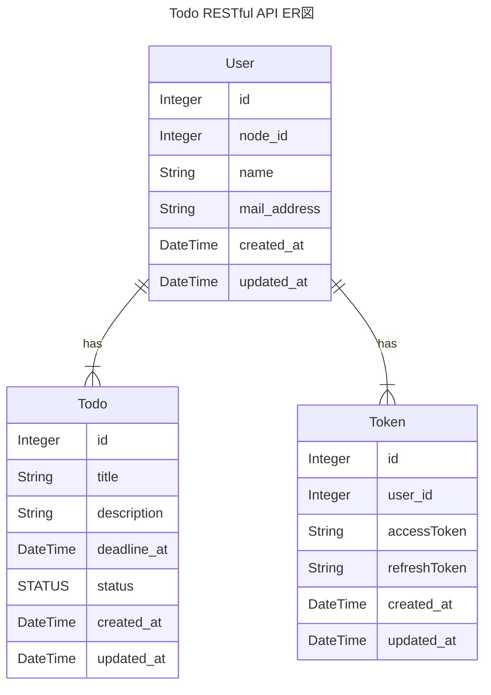

# Todo RESTful API

## 📡使用ライブラリ・フレームワーク

|ライブラリ・フレームワーク|バージョン|使用意図|
|---|---|---|
|Node.js|v18.18.2|開発言語|
|Volta|v1.1.1|Node.js管理ツール|
|Yarn|v1.22.19|packageマネージャー|
|TypeScript|v5.2.2|静的型付け用言語|
|ts-node|v10.9.1|TypeScriptのままNode.jsを実行できるようにする|
|Express|v4.18.2|Node.jsのWebフレームワーク|
|passport|v0.6.0|Node.jsの認証認可ミドルウェア|
|Docker| |仮想コンテナ環境構築プラットフォーム|

## yarn scriptsについて

|script|内容|
|---|---|
|`start`|サーバーの起動|
|`contaner`|Dockerコンテナの起動|
|`migrate`|Prismaのschemaファイルのマイグレート|
|`generate:swagger`|分割して作成したswaggerコンポーネントを一つのファイルに統合する|
|`generate:swagger-type`|swaggerを元にしたAPIの型定義を生成する|

## 📚ライブラリ・フレームワークのインストール

```zsh
# ライブラリのインストール
yarn

# remarkのためのインストール
npm install
```

### 💡voltaのインストール方法

以下コマンドで、LTSバージョンのNode.jsをインストールし、使用できるようになリます。パスも自動で通ります。

```zsh
curl https://get.volta.sh | bash
```

voltaをinstallしていただければ、`package.json`に記載しているnodeのバージョンを自動で読み取り、バージョンを合わせてくれます。

## 🐳Dockerについて

Dockerの設定を変える場合は、`docker-compose.yaml`を編集してください。

コンテナにログインするには、以下コマンドを実行してください。

```zsh
docker exec -it mysql-container zsh
```

## 🪵サインイン、サインアウトについて

<!-- TODO シーケンス図について書く -->

このTODOアプリでは、GitHubによる認証認可によってのみサインイン・サインアウトができます。

そのために、まずGitHubのDeveloper SettingのOAuth Applicationを登録してください。

そこで設定した`Client ID`、`Client secrets`、`Authorization callback URL`を`.env`ファイルに設定してください。

※ `Authorization callback URL`は`http://localhost:8080/api/v1/auth/github/callback`を設定してください。このアプリは、本番環境にデプロイする想定はないため、ローカル環境の固定値で設定します。

## 🌲.envについて

以下コードブロック内のkey名に合わせて設定してください。

`DATABASE_URL`：データソースにアクセスするためのURL。

```.env
DATABASE_URL=""

GITHUB_CLIENT_ID="" 
GITHUB_CLIENT_SECRET=""
GITHUB_CALLBACK_URL="http://localhost:8080/api/v1/auth/github/callback"
```

## ✏️ER図



## 📊 認証認可シーケンス

WIP
