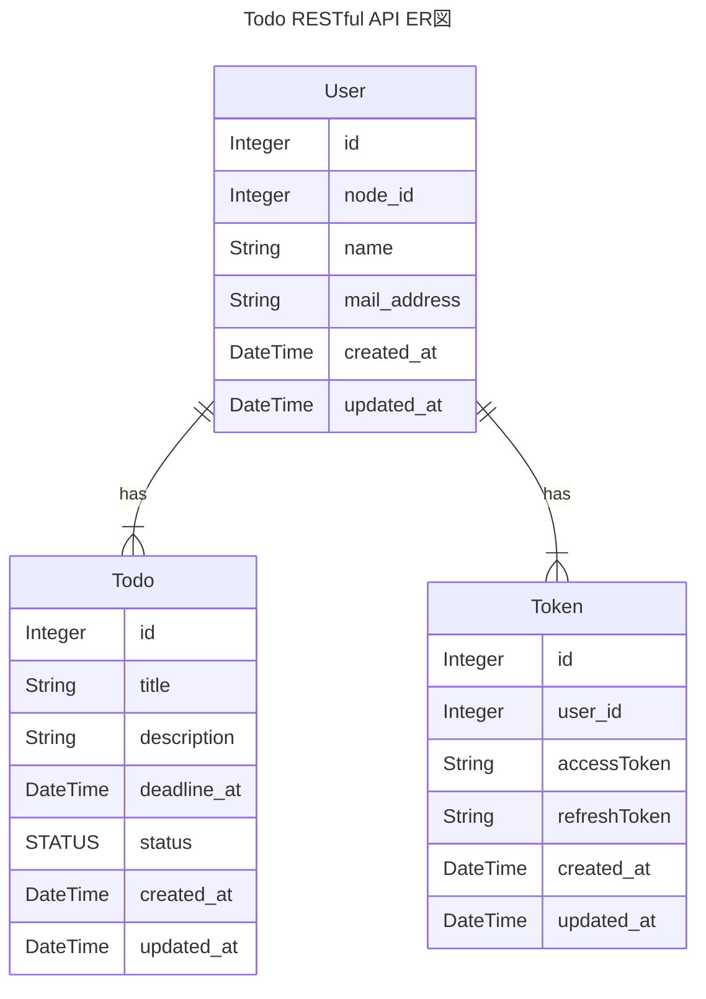

# Todo RESTful API

## 📡使用ライブラリ・フレームワーク

|ライブラリ・フレームワーク|バージョン|使用意図|
|---|---|---|
|Node.js|v18.18.2|開発言語|
|Volta|v1.1.1|Node.js管理ツール|
|Yarn|v1.22.19|packageマネージャー|
|TypeScript|v5.2.2|静的型付け用言語|
|ts-node|v10.9.1|TypeScriptのままNode.jsを実行できるようにする|
|Express|v4.18.2|Node.jsのWebフレームワーク|
|Docker|仮想コンテナ環境構築プラットフォーム|
|OpenAPI generator|swaggerからの型自動生成ツール。リクエストやレスポンスに型を定義するために使用する。|

## yarn scriptsについて

|script|内容|
|---|---|
|`start`|サーバーの起動|
|`contaner`|Dockerコンテナの起動|
|`migrate`|Prismaのschemaファイルのマイグレート|

## 📚ライブラリ・フレームワークのインストール

```zsh
# ライブラリのインストール
yarn

# remarkのためのインストール
npm install
```

### 💡voltaのインストール方法

以下コマンドで、LTSバージョンのNode.jsをインストールし、使用できるようになリます。パスも自動で通ります。

```zsh
curl https://get.volta.sh | bash
```

voltaをinstallしていただければ、`package.json`に記載しているnodeのバージョンを自動で読み取り、バージョンを合わせてくれます。

## 🐳Dockerについて

Dockerの設定を変える場合は、`docker-compose.yaml`を編集してください。

コンテナにログインするには、以下コマンドを実行してください。

```zsh
docker exec -it mysql-container zsh
```

## 📝OpenAPI generatorについて

OpenAPI generatorで自動生成したファイルは、/modelのみ使用しています。

他の自動生成された成果物は使用しません。

## ✏️ER図


